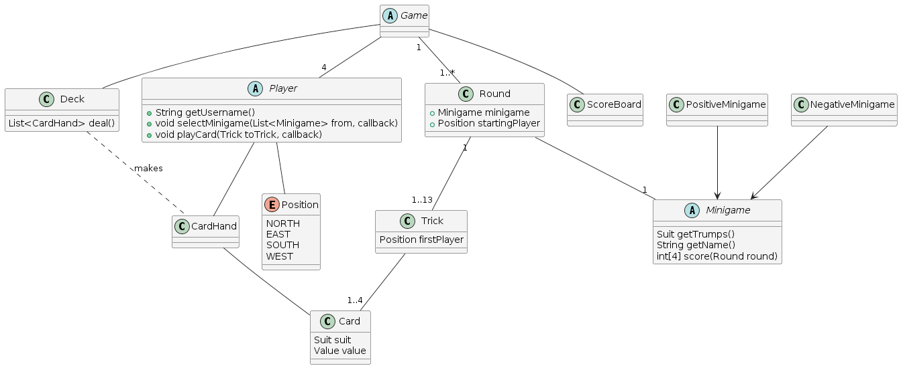
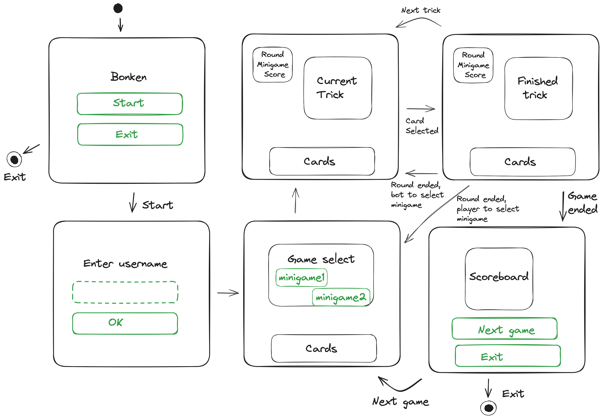

# Bonken 

Implementation of the game of Bonken in Java.

Credit program for the Programming in Java course at Faculty of Mathematics and Physics at Charles University.

Read more about the game of [Bonken on Wikipedia](https://en.wikipedia.org/wiki/Bonken).

> The rest of the readme is in Czech for purposes of the course.

## Zadání 

Zadání implementace dle odsouhlaseného emailu:

Chtěl bych implementovat hru Bonken. 
Jedná se zdvihovou karetní hru s původem v Nizozemí, pravidla hry se dají nalézt [například na Wikipedii](https://en.wikipedia.org/wiki/Bonken), implementoval bych variantu,
kde se místo minihry Domino hraje tzv. Beer card, kde hráč, který sebere károvou sedmu, ztratí 50 bodů.
(A dle tradice pocházející částečně také z bridže ostatním hráčům dluží pivo - to ale nemá vliv na implementaci). 
Jednalo by se o hru jednoho hráče, kde by protihráči byli řízeni počítačem, součástí aplikace by byl žebříček nejlepších výsledků.

Chtěl bych hru implementovat jako aplikaci s grafickým rozhraním.
Knihovny, které bych chtěl použít, by byly hlavně následující:

- JavaFx 
- JUnit 5

Jako build systém bych chtěl použít Maven.

## Spuštění

Aplikace se spustí přes Maven

```sh
mvn javafx:run
```

Lze také spustit konzolovou verzi aplikace:

```sh
mvn clean compile exec:java -P console
```

## Uživatelská dokumentace

### Pravidla hry

Hra Bonken je karetní hra pro 4 hráče. Cílem hry je získat co nejvíce bodů. Hra se hraje s francouzskými kartami bez žolíků.
Hraje se třináct v každém kole hráč zvolí minihru, kterou chce hrát. 
Jsou dva typy miniher: Pozitivní - jedna barva jsou trumfy a hráči dostanou body za každý vyhraný zdvih, a negativní: 
Hráči dostanou záporné body za sebrání určité karty.

### Ovládání

1. Klikněte na tlačítko "Start"
2. Zadejte své jméno a kliněte na tlačítko "OK"
3. Pro každé kolo:
   1. Vyberte minihru, kterou chcete hrát
   2. Přidejte kartu do zdvihu kliknutím na ni
   3. Dokončené zdvihy se zobrazí v pravém sloupci
4. Pro zobrazení aktuálního skóre najeďte myší na nápis skóre.
5. Číslo kola a aktuální minihra se zobrazuje v levém horním rohu.
6. Po dohrání všech kol se zobrazí výsledné skóre.

## Vývojářská dokumentace 

### Generování Javadoc

Javadoc s dokumentací kódu lze vygenerovat pomocí příkazu:

```sh
mvn compile javadoc:javadoc
```

Dokumentace se vygeneruje do adresáře `target/site/apidocs/`.

### Spuštění testů

Testy lze spustit pomocí příkazu:

```sh
mvn test
```

Test je jeden, který testuje model hry, jestli je hra dokončitelná.

### Struktura aplikace

Aplikace je rozdělena do čtyř balíčků:

- `cz.matfyz.zdenektomis.bonken.model` - obsahuje logiku hry
- `cz.matfyz.zdenektomis.bonken.ui` - obsahuje implementaci hry pro grafickou verzi aplikace
- `cz.matfyz.zdenektomis.bonken.console` - obsahuje implementaci hry pro konzolovou verzi aplikace
- `cz.matfyz.zdenektomis.bonken.utils` - obsahuje pomocné třídy

Program je založen na vzoru event-subscriber, kde třídy jako `Game`, `Round` a `Trick`, obsahují eventy, na které lze
napojit funkcionalitu, např. GUI.

Z tohoto důvodu tyto třídy berou jako parameter callable `executeLater`, která je používána pro asynchronní běh aplikace.
V JavaFX je tato callable implementována jako `Platform.runLater`, v konzolové verzi se k tomuto účelu používá Executor.

### Objektový model

Následující diagram znázorňuje objektový model hry.



Balíčky `ui` a `console` implementují třídy `Player` a `Game` z balíčku `model`.

### Průběh hry

Následující diagram ukazuje průběh hry v grafické verzi aplikace.

